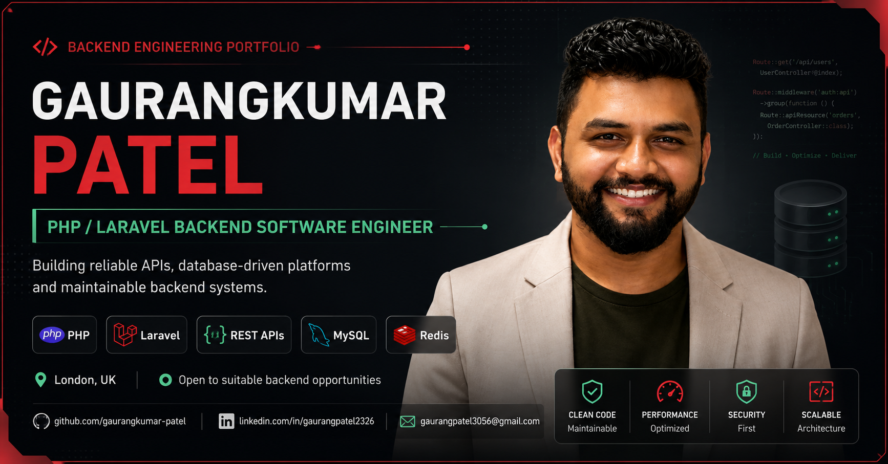

<div align="center">

# Gaurangkumar Patel - Backend Engineering Portfolio

### A recruiter-focused developer portfolio built as an interactive backend engineering control centre.

[](https://gaurangkumar-patel.github.io/portfolio/)
[](https://www.linkedin.com/in/gaurangpatel2326)
[](https://github.com/gaurangkumar-patel)

<br>

[](https://astro.build/)
[](https://react.dev/)
[](https://www.typescriptlang.org/)
[](https://threejs.org/)
[](https://github.com/features/actions)

</div>

---



## Live portfolio

### [gaurangkumar-patel.github.io/portfolio](https://gaurangkumar-patel.github.io/portfolio/)

This repository contains the source code for my personal backend software engineering portfolio.

It presents my professional experience, technical expertise, public projects, selected high-level commercial case studies and verified certifications through a responsive, accessible and recruiter-focused interface.

The visual direction combines a dark engineering control-centre theme with restrained 3D animation, skeuomorphic panels, system-status indicators and readable semantic content.

---

## Professional focus

I am a Backend Software Engineer based in London, specialising in:

- PHP and Laravel backend development
- REST API design and third-party integrations
- MySQL database modelling and optimisation
- Redis caching and performance improvement
- Authentication, authorisation, OAuth2 and JWT
- Background automation and data-processing workflows
- React-powered administration interfaces
- Maintainable database-driven web applications

The portfolio separates public source-code projects from confidential commercial work. Employer-owned and proprietary code is not published.

---

## Portfolio highlights

### Interactive engineering interface

The homepage uses a custom React Three Fiber scene to present an animated backend core without making essential information dependent on WebGL.

### Verified professional content

Experience, skills and certifications are maintained against the latest confirmed Master Backend Software Engineer CV.

### Project case studies

Public projects include repository and live-demo links where available. Commercial work is represented only through approved high-level descriptions and technology summaries.

### Recruiter-focused conversion

The interface provides direct access to:

- professional experience
- technical expertise
- project case studies
- verified certifications
- downloadable CV
- GitHub and LinkedIn profiles
- email contact

### SEO and social sharing

The application includes:

- canonical URLs
- Open Graph metadata
- Twitter/X card metadata
- structured data
- sitemap generation
- `robots.txt`
- favicon and web-app manifest
- custom social-preview artwork

### Accessibility-conscious design

The implementation includes:

- semantic HTML content
- keyboard-accessible navigation
- visible focus states
- skip-to-content support
- descriptive alternative text
- reduced-motion handling
- responsive layouts
- decorative effects separated from essential content

---

## Technology stack

| Area           | Technologies                               |
| -------------- | ------------------------------------------ |
| Framework      | Astro 7                                    |
| UI integration | React 19                                   |
| Language       | TypeScript                                 |
| 3D rendering   | Three.js, React Three Fiber, Drei          |
| Animation      | GSAP, CSS transforms and transitions       |
| Styling        | Custom responsive CSS                      |
| SEO            | Astro Sitemap, Open Graph, structured data |
| Deployment     | GitHub Actions and GitHub Pages            |
| Runtime        | Node.js 22.12 or later                     |

---

## Architecture

```text
portfolio/
├── .github/
│   └── workflows/
│       └── deploy.yml
├── public/
│   ├── social/
│   ├── favicon.svg
│   ├── icon-192.png
│   ├── icon-512.png
│   ├── robots.txt
│   └── site.webmanifest
├── src/
│   ├── assets/
│   │   ├── profile/
│   │   └── projects/
│   ├── components/
│   │   ├── layout/
│   │   ├── sections/
│   │   ├── ui/
│   │   └── HeroScene.tsx
│   ├── data/
│   │   ├── certifications.ts
│   │   ├── contact.ts
│   │   ├── experience.ts
│   │   ├── expertise.ts
│   │   ├── navigation.ts
│   │   ├── profile.ts
│   │   ├── projects.ts
│   │   └── seo.ts
│   ├── layouts/
│   │   └── BaseLayout.astro
│   ├── pages/
│   │   ├── projects/
│   │   │   └── [slug].astro
│   │   └── index.astro
│   └── styles/
│       └── global.css
├── astro.config.mjs
├── package.json
└── tsconfig.json
```

### Content-driven structure

Professional content is stored in typed files under `src/data/`. This keeps page components reusable and separates verified content from presentation logic.

### Reusable sections

The homepage is assembled from independent Astro components for navigation, profile, expertise, experience, projects, certifications, personal introduction, contact and footer content.

### Static case-study routes

Project case-study pages are generated from the structured project data using Astro's dynamic route generation.

---

## Local development

### Requirements

- Node.js `22.12.0` or later
- npm
- Git

### Installation

```bash
git clone https://github.com/gaurangkumar-patel/portfolio.git
cd portfolio
npm ci
```

### Start the development server

```bash
npm run dev
```

The local development server is available at:

```text
http://localhost:4321/portfolio/
```

### Create a production build

```bash
npm run build
```

The generated static site is written to:

```text
dist/
```

### Preview the production build

```bash
npm run preview
```

---

## Available commands

| Command                   | Purpose                                                        |
| ------------------------- | -------------------------------------------------------------- |
| `npm ci`                  | Install the exact dependencies recorded in `package-lock.json` |
| `npm run dev`             | Start the Astro development server                             |
| `npm run build`           | Generate the production site                                   |
| `npm run preview`         | Preview the production build locally                           |
| `npm run astro -- --help` | Display Astro CLI help                                         |

---

## GitHub Pages deployment

Production deployments are handled automatically by:

```text
.github/workflows/deploy.yml
```

The workflow runs whenever a commit is pushed to `main`.

Deployment process:

```text
Push to main
      ↓
Install dependencies with npm ci
      ↓
Build the Astro application
      ↓
Upload the dist directory
      ↓
Deploy through GitHub Pages
```

The Astro production configuration uses:

```text
Site: https://gaurangkumar-patel.github.io
Base: /portfolio
```

This ensures generated assets, canonical URLs, sitemap entries and project routes work correctly under the GitHub Pages repository path.

---

## Performance and quality

The portfolio has been tested using production builds, responsive browser layouts and Lighthouse audits.

Confirmed audit results from the current launch review:

| Audit          | Desktop | Mobile |
| -------------- | ------: | -----: |
| Performance    |     100 |     79 |
| Accessibility  |     100 |    100 |
| Best Practices |     100 |    100 |
| SEO            |     100 |    100 |

The current version is live and functional. Further mobile JavaScript and 3D-rendering optimisation is planned as a separate improvement phase.

---

## Privacy and intellectual property

This repository does not publish:

- employer-owned source code
- commercial client source code
- GlistPro proprietary implementation details
- private database schemas
- marketplace mappings
- credentials or environment files
- confidential documents or screenshots

Commercial experience is presented only through approved public summaries.

---

## Project status

**Status:** Live and actively maintained

Current production version includes:

- complete portfolio content architecture
- professional experience timeline
- expertise modules
- public and summary-only project case studies
- verified certifications
- contact and CV actions
- responsive navigation
- custom social-preview assets
- SEO and structured metadata
- automated GitHub Pages deployment

Possible future enhancements are tracked separately and should not be treated as implemented features.

---

## Contact

**Gaurangkumar Patel**
Backend Software Engineer — PHP, Laravel, REST APIs and SaaS

- Portfolio: [gaurangkumar-patel.github.io/portfolio](https://gaurangkumar-patel.github.io/portfolio/)
- GitHub: [github.com/gaurangkumar-patel](https://github.com/gaurangkumar-patel)
- LinkedIn: [linkedin.com/in/gaurangpatel2326](https://www.linkedin.com/in/gaurangpatel2326)
- Email: [gaurangpatel3056@gmail.com](mailto:gaurangpatel3056@gmail.com)

---

## Usage and licence

This repository is publicly available for portfolio review and technical evaluation.

No open-source licence is currently granted. Unless a licence is added later, reuse, redistribution or modification rights are not automatically provided.

---

<div align="center">

### Built with Astro, React, TypeScript and Three.js

[View live portfolio](https://gaurangkumar-patel.github.io/portfolio/) ·
[Explore GitHub profile](https://github.com/gaurangkumar-patel) ·
[Connect on LinkedIn](https://www.linkedin.com/in/gaurangpatel2326)

</div>
